# Exploration of Enron email data set

The goal of this project is to learn how to collect, filter, aggregate, explore, and visualize data from a large collection of files. Our data set is a well-known collection of emails, sent and received within an energy company called Enron, that was collected by the FBI as part of a massive fraud investigation. According to an [FBI retrospective](https://www.fbi.gov/history/famous-cases/enron), "*The Enron Task Force’s efforts resulted in the convictions of nearly all of Enron’s executive management team*" and goes on to say:

> Top officials at the Houston-based company cheated investors and enriched themselves through complex accounting gimmicks like overvaluing assets to boost cash flow and earnings statements, which made the company even more appealing to investors. When the company declared bankruptcy in December 2001, investors lost millions

This is purely an exercise, but it's interesting to see how with a small bit of effort we can identify some unusual email behavior that could indicate inappropriate activity. For example, [Fortune magazine](https://archive.fortune.com/magazines/fortune/fortune_archive/2005/03/07/8253428/index.htm) reports that "*the former head of Enron's trading operations, John Lavorato, [...] sold all his Enron stock in spring 2001 at about \$63 per share. (It was worth pennies by December.)*" Now, take a look at the histogram depicting the email activity sent by Lavorato.  About the time he knew they were going to be busted, he all of a sudden stops communicating over email, at least his work email, which is weird for a top executive. He must have started using a private channel to hide communications with co-conspirators.

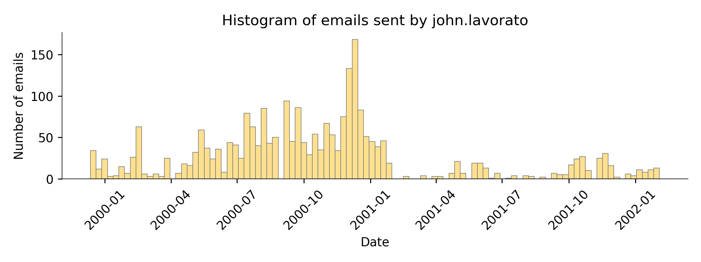

There are two primary tasks:

1. Load 1.5G worth of email messages and construct a tidy data frame that is much easier to process than the raw data (takes about 3 minutes); you will save this in [feather format](https://pypi.org/project/pyarrow) so that it can be loaded extremely quickly; here's a sample:<br>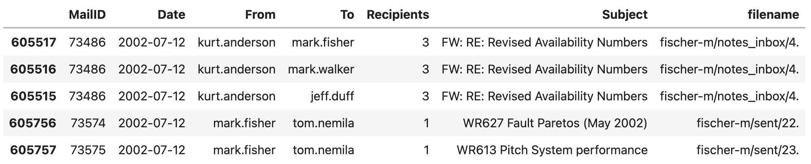
2. Create a jupyter notebook that loads the data frame created in the previous step and then generates tables and visualizations as part of an exploration. (Details below.)


## Process 1.5G of Enron email

The first goal is to create a condensed version of the enron email messages in the form of a data frame and then save that in feather format. The email is stored in a series of subdirectories organized by person and by mail folders, where the individual messages are numbered as you can see here:

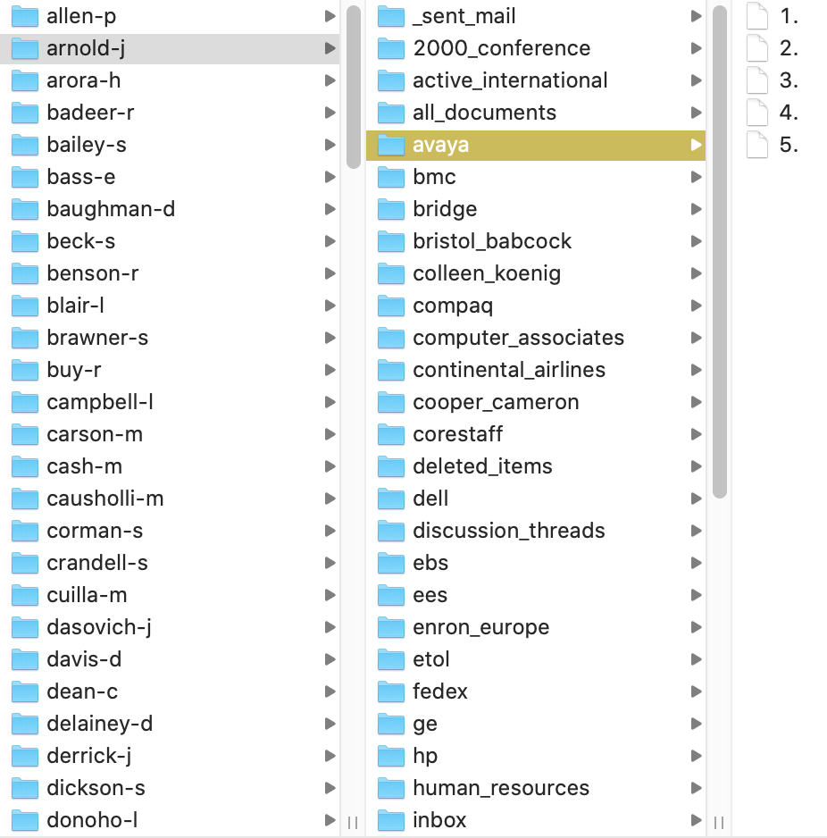

The Python script `condense.py` can be excuted like this:

`python condense.py` *path-to-maildir*

where *path-to-maildir* indicates the exact path of your mail directory. This allows us to place the mail directory anywhere on the disk and still use the same script.


In the result dataframe, `Recipients` indicates the number of people on the `To:` line for a single email message file and `filename` is the **subdirectory** of `maildir` plus the filename that contains the mail message. `MailID` is a counter 1..n for n valid email message files.


### Getting started by sniffing the data

The grayed out stuff is what we can ignore in order to build the data frame. The orange is the data we need to extract and the black text is the set of sentinels we must look for to extract the data.

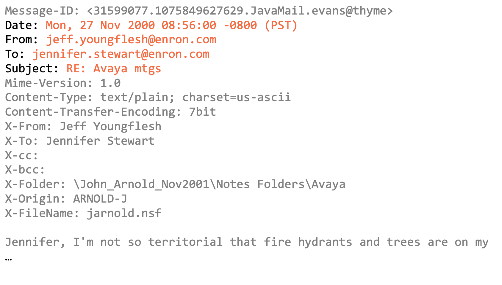


Many of the email messages were be ignored. Such as messages that have no `To:` line, sender and recipient email addresses that are not Enron related, etc.


Normalize the email addresses by getting rid of single quotes (anywhere in string) and delete any `.` (dot) at the start of an email address:

* `'.''bill@enron.com` &rightarrow; `bill@enron.com`
* `'arnold@enron.com` &rightarrow; `arnold@enron.com`
* `'.'delaney@enron.com` &rightarrow; `delaney@enron.com`


The final dataframe shchema lookslike this:

```
 #   Column      Dtype
---  ------      -----
 0   MailID      int64
 1   Date        object
 2   From        object
 3   To          object
 4   Recipients  int64
 5   Subject     object
 6   filename    object
```

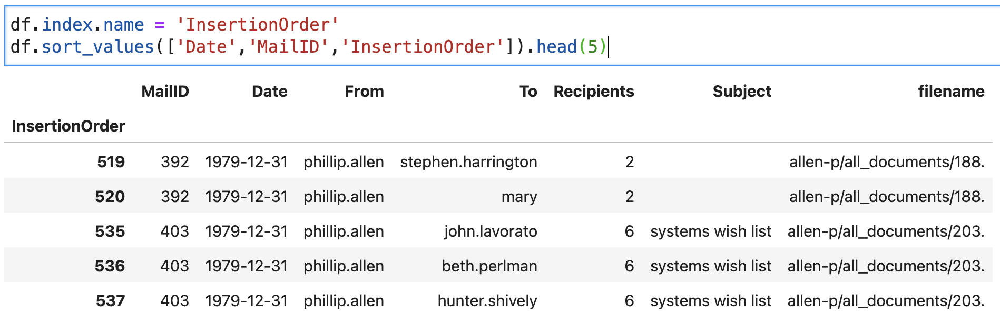


## Exploring email traffic

### Email traffic over time
Histograms showed the amount of traffic per day. Then specifically for email sent from `richard.shapiro` and then `john.lavorato`.

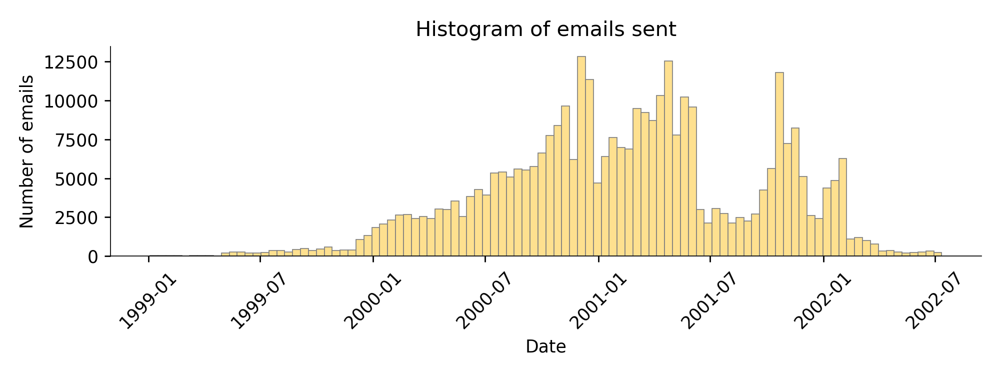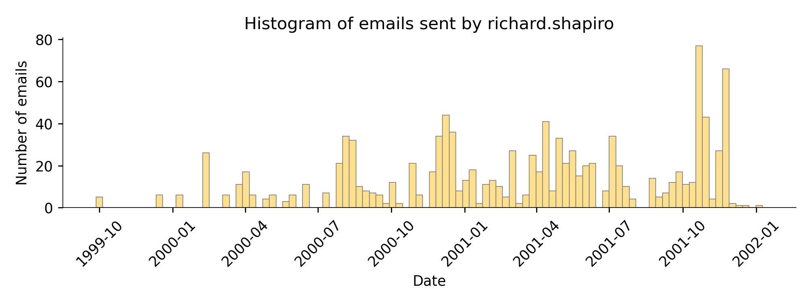<br>
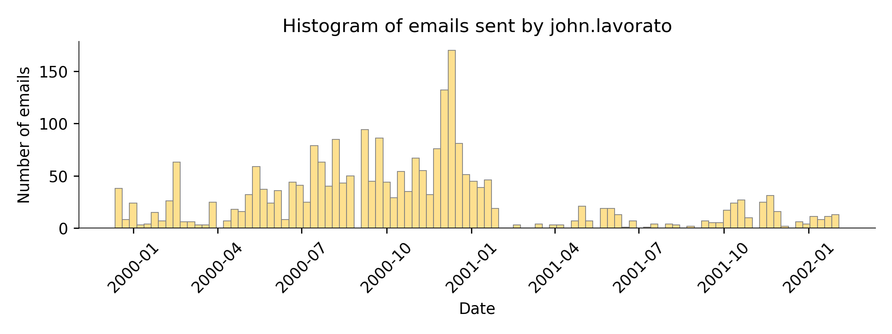

### Histogram of email messages sent and received


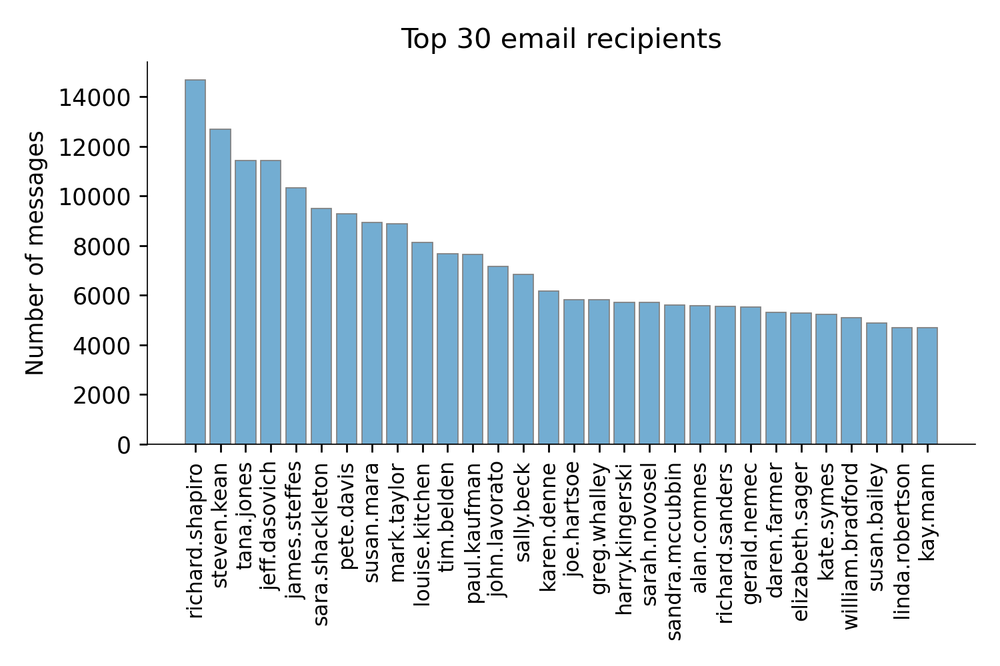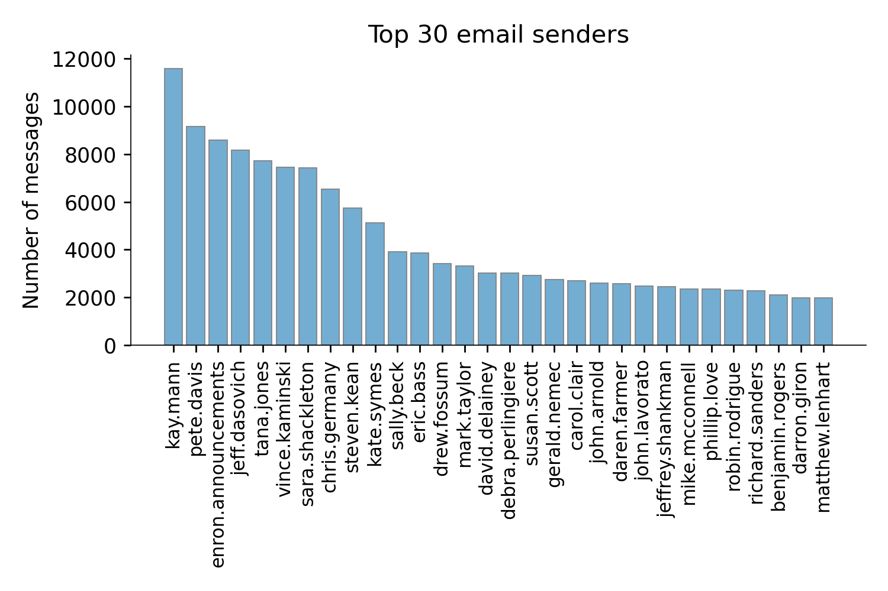

### Heatmap showing number of email messages between employees

Given a list of Enron employees, compute a heat map that indicates how much email traffic was exchanged between each pair of employees.

```python
people = ['jeff.skilling', 'kenneth.lay', 'louise.kitchen', 'tana.jones',
          'sara.shackleton', 'vince.kaminski', 'sally.beck', 'john.lavorato',
          'mark.taylor', 'greg.whalley', 'jeff.dasovich', 'steven.kean',
          'chris.germany', 'mike.mcconnell', 'benjamin.rogers', 'j.kaminski',
          'stanley.horton', 'a..shankman', 'richard.shapiro']
```                 
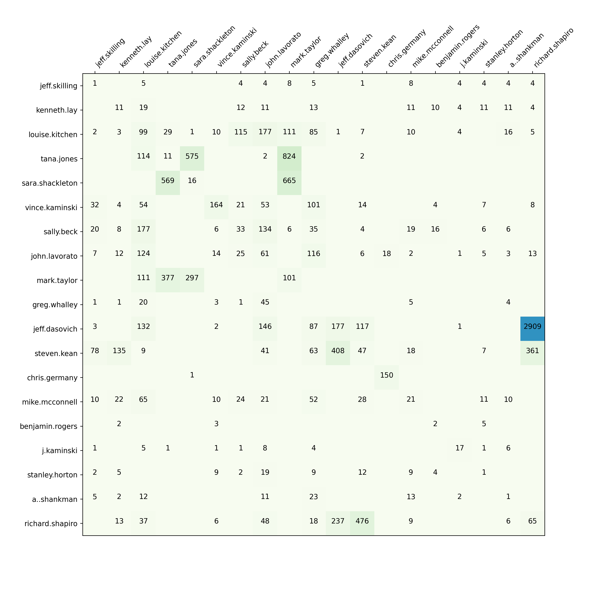

## Exploring email connection graph

From the data frame, create a **directed** graph data structure using [networkx](https://networkx.org/). Create an edge from node A to node B if there is an email from A to B in the data frame.

### PageRank between users

Using networkx, compute the pagerank between all nodes. Get the data into a data frame, sort in reverse order, and display the top 15 users from the data frame.

```
                 PageRank
jeff.skilling    0.004966
kenneth.lay      0.004579
louise.kitchen   0.004494
tana.jones       0.004299
sara.shackleton  0.004022
vince.kaminski   0.003850
sally.beck       0.003577
john.lavorato    0.003467
gerald.nemec     0.002643
rod.hayslett     0.002540
mark.taylor      0.002514
greg.whalley     0.002280
jeff.dasovich    0.002264
daren.farmer     0.002007
steven.kean      0.002003
```

The PageRank indicates the most "important" people, as computed by the number of outgoing and incoming email for a particular user. Without having to do any thinking, it quickly pops up the executives near the top of the list. A nice trick.

### Measuring centrality of users

Compute the centrality for the nodes of the graph. The documentation says that centrality is "*the fraction of nodes it is connected to.*"

```
                  Centrality
sally.beck          0.088048
outlook.team        0.082401
david.forster       0.079988
kenneth.lay         0.076137
technology.enron    0.063662
jeff.skilling       0.058220
tana.jones          0.054677
louise.kitchen      0.053445
jeff.dasovich       0.048773
sara.shackleton     0.047952
tracey.kozadinos    0.047387
john.lavorato       0.046822
julie.clyatt        0.045847
bodyshop            0.044922
david.oxley         0.043793
```

### Visualizing graph subsets

The email graph is way too large to display the whole thing and get any meaningful information out. However, we can look at subsets of the graph such as the neighbors of a specific node. To visualize it we can use different strategies to layout the nodes. In this case, we will use two different layout strategies: *spring* and *kamada-kawai*.

Use networkx `ego_graph()` method to get a radius=1 neighborhood around `jeff.skilling`:

#### Skilling spring layout


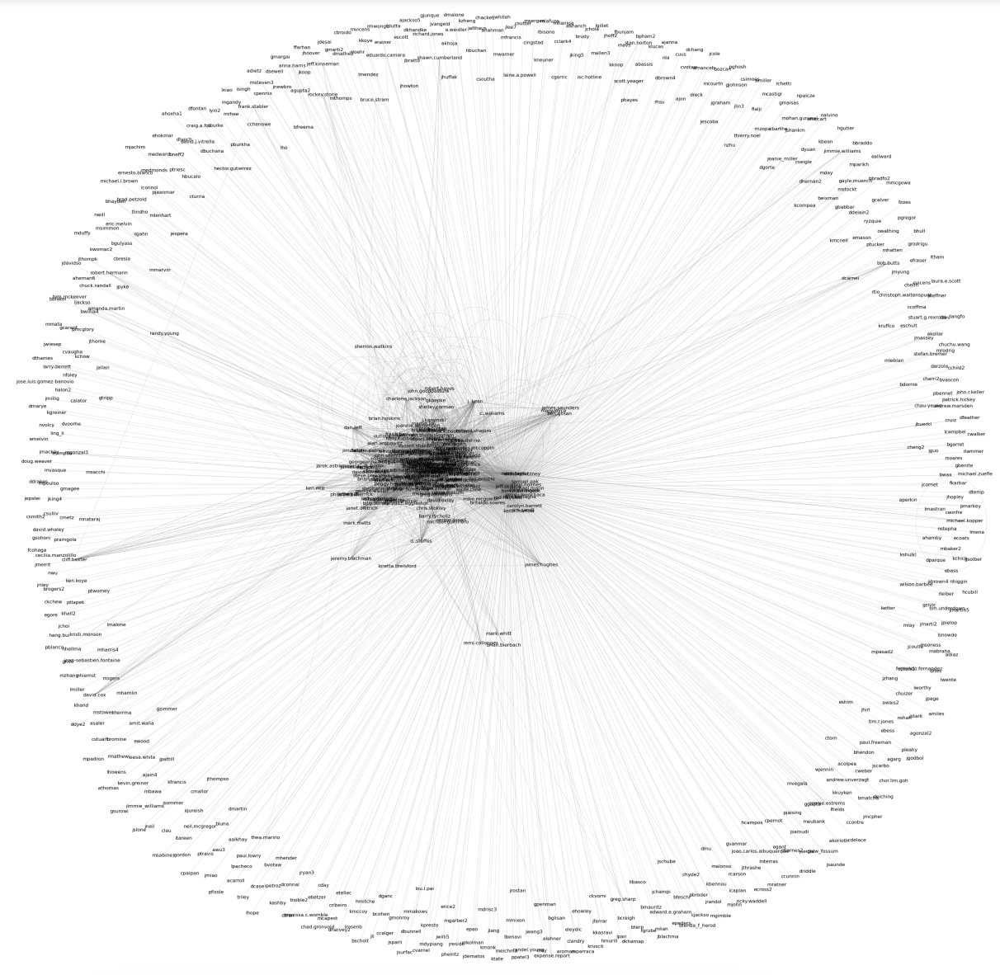

#### Skilling kamada layout
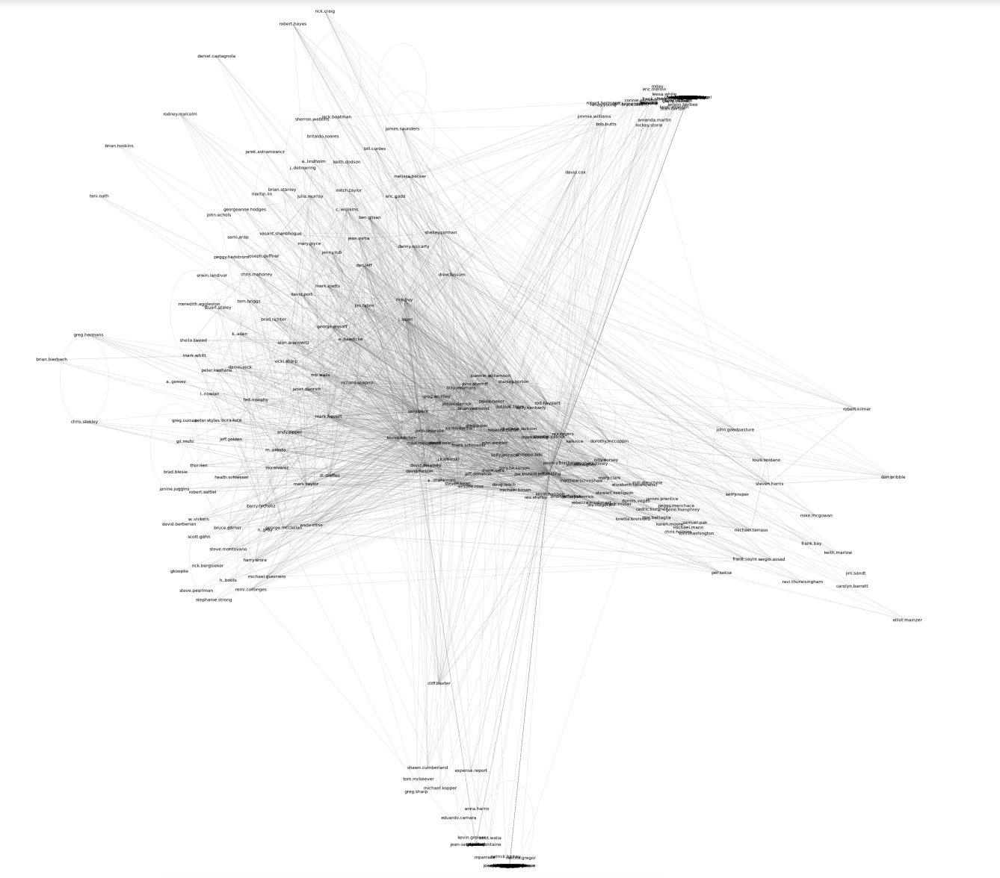

#### Skilling kamada layout
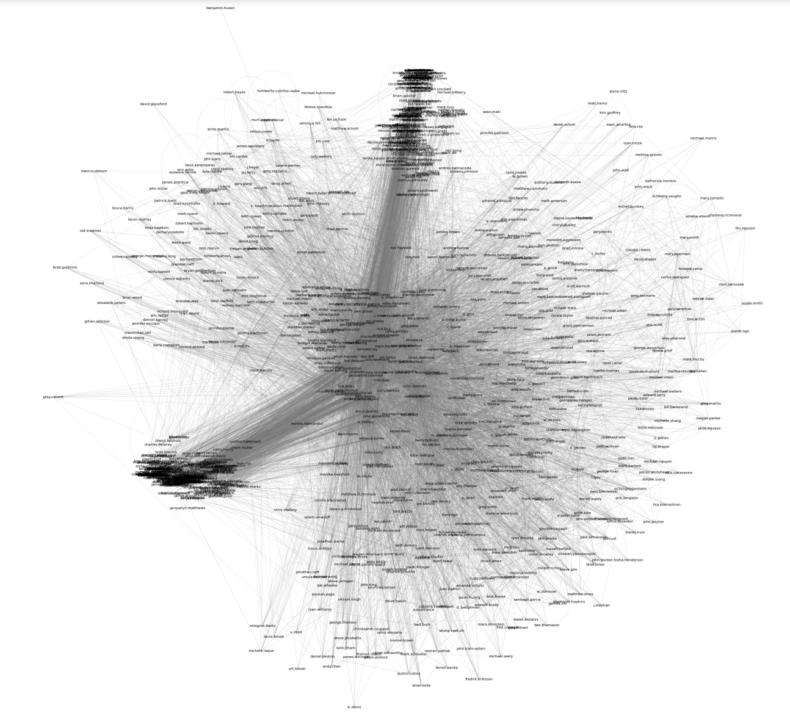


## About


* `condense.py` This is the script that reads all of the emails and creates the handy data frame in feather format, storing the feather file in the current working directory. It takes a commandline argument indicating the directory containing the Enron mail. E.g., my directory is `~/data/maildir`.
* `enron.ipynb` explorations and visualizations for this project description.
* `enron.pdf` This is the PDF exported or generated from the notebook.

## Reference
[`Exploration of Enron email data set`](https://github.com/parrt/msds501/blob/master/projects/enron.md)
